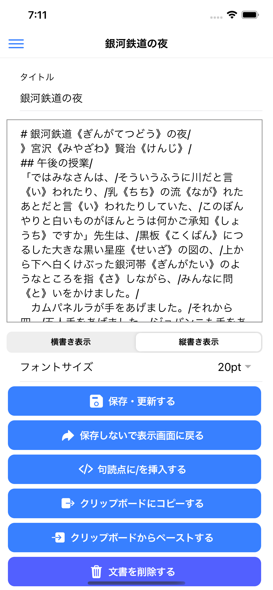
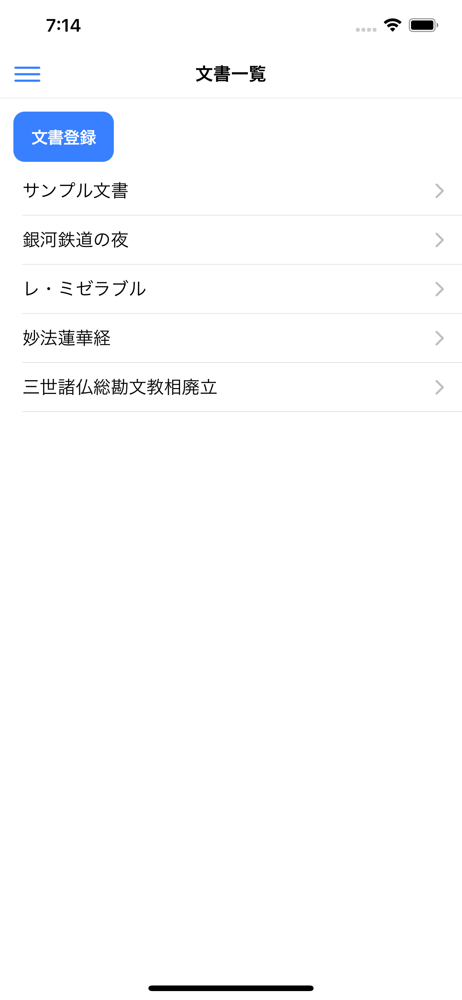

# 文章暗記 ionic プロジェクト

「文章暗記」(ぶんしょうあんき)は、スマートフォン、タブレット向けのアプリです。  
このアプリは、暗記したい文章がある時に、それを暗記できるようにサポートします。  
たとえば、古典、経典、 詩歌(しいか)、スピーチ原稿、台本などの文章を、暗記・暗誦(あんしょう)したい時に、このアプリを使ってトレーニングすることができます。  
試験勉強にもお使いいただけます。  
このアプリでは、登録された文章が黒塗りで表示されます。黒塗りの位置を、先頭から末尾まで、少しずつ移動しながら暗記していきます。

---

## ホームページ

[https://mnitta220.github.io/bnan/](https://mnitta220.github.io/bnan/)

> このアプリのソースコードを公開しています。  
> 詳しくは、「[開発情報](https://mnitta220.github.io/bnan/develop/)」をご覧ください。

---

## 画面イメージ

### ■ アイコン

### ■ 文書表示画面

#### [縦書き表示]

#### [横書き表示]

### ■ 文書登録画面

### ■ 文書一覧画面

---

## App ストア (iPhone、iPad 向け)

[iPhone、iPad 向け紹介ページ](https://apps.apple.com/jp/app/%E6%96%87%E7%AB%A0%E6%9A%97%E8%A8%98/id1532800981)

---

## Google Play (Android 向け)

近日中にリリースします。

---

Copyright &copy; 2020 Masahiro Nitta. All rights reserved.
